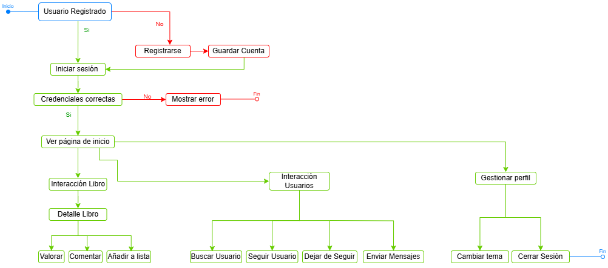

El **Diagrama de Actividades** representa el flujo de operaciones que realiza un usuario en la plataforma desde el inicio de sesión hasta la interacción con libros y usuarios. Este tipo de diagrama ayuda a entender cómo se desarrollan las acciones en el sistema de forma secuencial y ramificada.

## 🧭 Flujo General

El flujo se basa en las siguientes actividades:

1. **Inicio de sesión / Registro**
   - Verificación de credenciales.
   - Acceso autorizado o mensaje de error.

2. **Exploración de Libros**
   <!-- - Buscar y filtrar libros. -->
   - Seleccionar un libro para ver más detalles.
   - Realizar acciones: puntuar, comentar, añadir a lista.

3. **Interacción con otros Usuarios**
   - Buscar usuarios.
   - Seguir o dejar de seguir.
   - Enviar mensajes privados.

4. **Gestión de Perfil**
   <!-- - Acceder a lista de lectura. -->
   - Eliminar o modificar libros.
   - Cerrar sesión.

---

## 🖼️ Diagrama Visual

El diagrama presenta decisiones condicionales (`sí / no`), bifurcaciones y finalizaciones. Puedes consultarlo a continuación:

> 💡 *Este tipo de diagrama es útil para validar la lógica de procesos antes de implementar el sistema.*

---

## 🛠️ Herramientas Utilizadas

Este diagrama fue creado usando **draw.io**.

---
