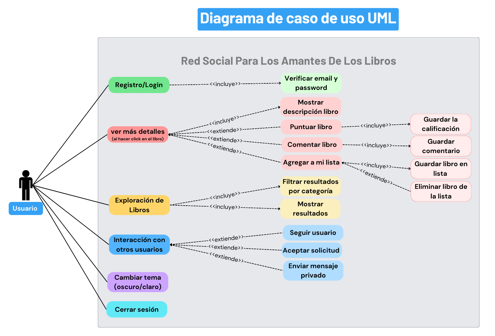

El **Diagrama de Casos de Uso** representa las principales interacciones del usuario con la plataforma **Red Social para Amantes de los Libros**. Se identifican los casos de uso clave y sus relaciones, incluyendo inclusiones (**«include»**) y extensiones (**«extend»**).

## 📝 Actores Principales
- **Usuario registrado**: Puede realizar todas las acciones disponibles en la plataforma.

## 📌 Descripción de los Casos de Uso

### 🔐 Registro e Inicio de Sesión
El usuario puede crear una cuenta o acceder a su perfil mediante:
- **Registro/Login** (Incluye ↓)
  - **Verificar email y contraseña**  
 
### 📚 Exploración de Libros
El usuario puede buscar y filtrar libros disponibles en la plataforma:
- **Explorar libros** (Incluye ↓)
  - **Filtrar resultados**  
  - **Mostrar resultados**  

Al seleccionar un libro, se despliegan más detalles:
- **Ver más detalles** (Incluye ↓)
  - **Mostrar descripción del libro**
  - **Puntuar libro** (_Extiende_) → **Guardar calificación** (_Incluye_)  
  - **Comentar libro** (_Extiende_) → **Guardar comentario** (_Incluye_)  
  - **Agregar a mi lista** (_Extiende_) → **Guardar libro en lista** (_Incluye_)  
  - **Eliminar libro de la lista** (_Extiende_)  

### 👥 Interacción con Otros Usuarios
Los usuarios pueden interactuar entre sí:
- **Interacción con otros usuarios** (_Extiende_)  
  - **Seguir usuario** (_Extiende_) → **Aceptar solicitud** (_Extiende_)  
  - **Enviar mensajes privados** (_Extiende_)  

### 🎨 Personalización y Seguridad
- **Cambiar entre modo oscuro/claro**  
- **Cerrar sesión**  

---

## 🖼️ Diagrama Visual
A continuación, se presenta el **Diagrama de Casos de Uso** donde se ilustran las relaciones entre los actores y sus interacciones con el sistema:

> **Nota:** Las relaciones **«include»** indican acciones obligatorias, mientras que **«extend»** señala acciones opcionales que dependen de otro caso de uso.

---

## 🛠️ Herramientas Utilizadas
Este diagrama fue diseñado en **Canvas**.

---

> _Este diagrama es clave para comprender el flujo de interacción del usuario dentro de la plataforma._