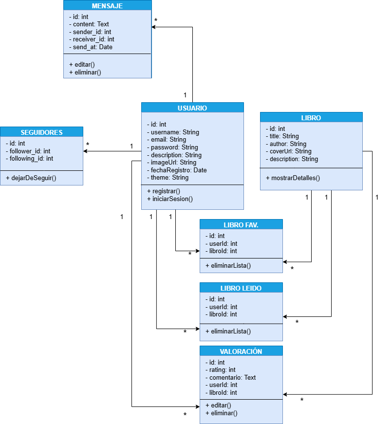

El **Diagrama de Clases** define la estructura estática del sistema, mostrando las clases principales del dominio, sus atributos y métodos, así como las relaciones entre ellas. Es una herramienta clave para comprender cómo se organiza el código y cómo interactúan los objetos dentro de la plataforma **Red Social para Amantes de los Libros**.

---

## 🧱 Estructura General

Las clases están organizadas de acuerdo con funcionalidades clave del sistema:

- **Usuario**: Representa al usuario registrado, con sus datos personales, tema elegido y métodos de autenticación.
- **Libro**: Almacena información de los libros disponibles en la plataforma.
- **Valoración**: Permite a los usuarios puntuar y comentar libros.
- **LibroFavorito / LibroLeído**: Representan listas de libros gestionadas por el usuario.
- **Mensaje**: Modela la mensajería privada entre usuarios.
- **Seguidores**: Gestiona la relación de seguimiento entre usuarios, permitiendo también dejar de seguir.

---

## 🔗 Relaciones entre Clases

- Un **Usuario** puede tener muchas **Valoraciones**, **Mensajes**, **Libros Favoritos** y **Libros Leídos**.
- Un **Libro** puede tener muchas **Valoraciones** y estar en múltiples listas de usuarios.
- Un **Mensaje** tiene un emisor y un receptor, ambos de tipo **Usuario**.
- La entidad **Seguidores** relaciona usuarios entre sí, indicando quién sigue a quién.

---

## 📚 Métodos y Funcionalidades

- Los usuarios pueden:
  - Registrarse e iniciar sesión.
  - Seguir o dejar de seguir a otros usuarios.
  - Enviar y recibir mensajes.
  - Añadir libros a su lista de favoritos o leídos.
  - Valorar libros con puntuación y comentario.

- Los libros ofrecen un método para mostrar detalles al usuario.
- Las clases de interacción (Valoración, LibroFav, LibroLeído) cuentan con métodos básicos como eliminar o editar su contenido.
- La clase **Seguidores** incorpora el método `dejarDeSeguir()` para eliminar la relación entre dos usuarios.

---

## 🖼️ Diagrama Visual

A continuación, se muestra el **Diagrama de Clases** correspondiente al sistema:

> ℹ️ Las líneas entre clases indican relaciones de asociación directa con multiplicidades como 1 a 1 o 1 a muchos, según el modelo relacional subyacente. No se utiliza herencia ni composición en este diseño.

---

## 🛠️ Herramientas Utilizadas

Este diagrama fue creado con **draw.io** para representar gráficamente las entidades del sistema y su lógica relacional.

---

> _El Diagrama de Clases proporciona una visión clara de cómo se estructuran los datos en el sistema y cómo se comunican entre las diferentes partes de la aplicación._
