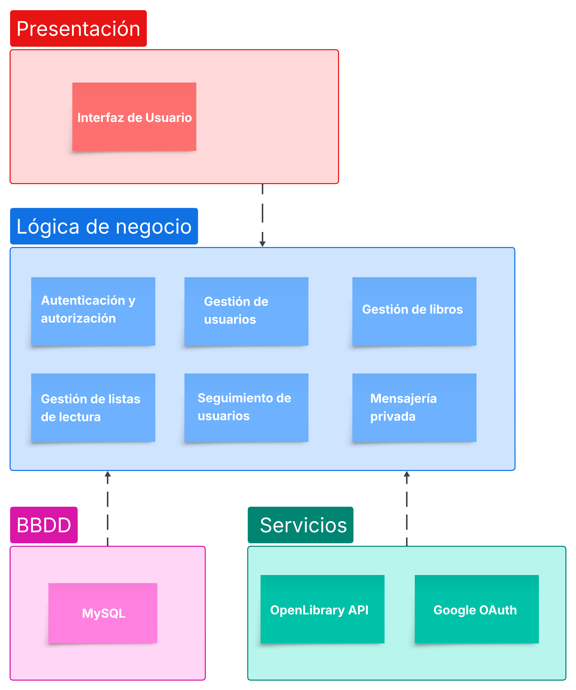

El **Diagrama de Componentes** representa la arquitectura lógica del sistema de la plataforma **Red Social para Amantes de los Libros**. En él se muestra la organización modular del software, evidenciando las responsabilidades de cada componente, sus interacciones y las tecnologías involucradas.

---

## 🧩 Componentes Principales

### 🖥️ Capa de Presentación
- Compuesta por la **Interfaz de Usuario**.
- Es accesible desde navegador o dispositivos móviles.
- Permite a los usuarios visualizar y enviar información.
- Se comunica directamente con la lógica de negocio.

---

### ⚙️ Capa de Lógica de Negocio
Encargada del procesamiento y gestión central del sistema. Está conformada por los siguientes módulos:

- **Autenticación y autorización**: Gestiona inicios de sesión y permisos mediante Google OAuth y Spring Security.
- **Gestión de usuarios**: Registro, edición de perfil y eliminación de cuentas.
- **Gestión de libros**: Búsqueda, consulta y administración de información bibliográfica.
- **Gestión de listas de lectura**: Crear y administrar listas personalizadas de libros.
- **Seguimiento de usuarios**: Funcionalidad de "follow" entre miembros de la red.
- **Mensajería privada**: Comunicación directa entre usuarios registrados.

---

### 🗄️ Base de Datos
- Motor: **MySQL**
- Almacena de forma persistente toda la información relevante: usuarios, libros, listas, relaciones y mensajes.

---

### 🌐 Servicios Externos
La plataforma se apoya en servicios externos para extender sus funcionalidades:

- **OpenLibrary API**: Fuente de información externa para datos bibliográficos.
- **Google OAuth**: Servicio de autenticación segura mediante cuentas de Google.

---

## 🔁 Flujo de Información

1. El usuario interactúa con la **interfaz de usuario**.
2. Las acciones se procesan en la **lógica de negocio**.
3. Si es necesario, se consulta la **base de datos** o los **servicios externos**.
4. El sistema devuelve respuestas y actualiza la interfaz.

---

## 🖼️ Diagrama Visual

A continuación, se presenta el **Diagrama de Componentes** correspondiente al sistema:

> 🧠 *Este diagrama facilita la comprensión del diseño modular y funcional de la aplicación, identificando claramente las dependencias entre capas, el rol de los servicios externos y el flujo de datos principal.*

---

## 🛠️ Herramientas Utilizadas
Este diagrama fue diseñado utilizando **Lucid.app**.

---

> _Comprender la arquitectura por componentes permite mantener, escalar y extender la aplicación de manera eficiente y ordenada._
