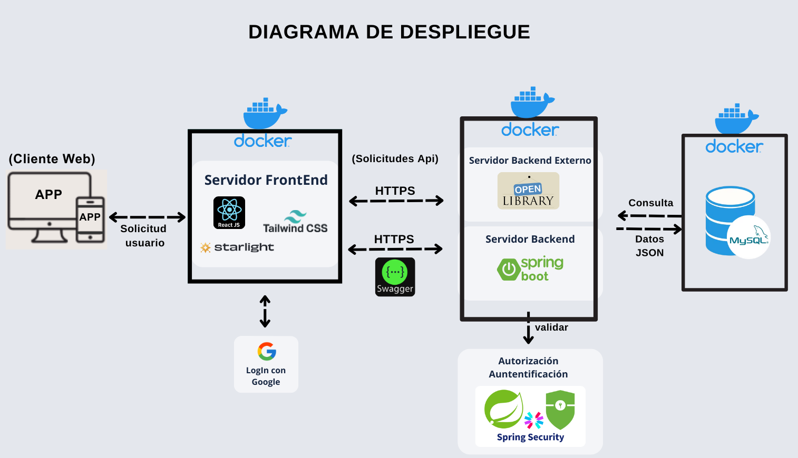

El **Diagrama de Despliegue** describe la arquitectura física del sistema, mostrando los nodos (dispositivos o servidores), componentes desplegados y sus conexiones. Es clave para comprender cómo y dónde se ejecutan los elementos del software.

---

## 🌐 Comunicaciones Externas

- 🧑‍💻 **Cliente Web (navegador)** → `Frontend` mediante **HTTP**
- 📚 `Backend` → **API Externa OpenLibrary** mediante **HTTP**
- 🔐 `Backend` → **Servicio Google OAuth** mediante **HTTPS**

---

## 📌 Resumen

---

### Docker
- Todos los componentes del sistema están desplegados en contenedores dentro de un único **Docker Host**, facilitando el despliegue, escalabilidad y mantenimiento.

---

### Frontend
- El **cliente web (navegador)** accede al sistema a través del contenedor `frontend`, que sirve una **SPA (Single Page Application)** desarrollada en React.
- El contenedor `frontend` se comunica vía **HTTP** con el contenedor `backend`, el cual está construido con **Spring Boot**.

---

### Backend
- El **backend** gestiona:
  - La lógica de negocio (REST).
  - La seguridad mediante **Spring Security** y autenticación OAuth con Google.
  - La documentación mediante **Swagger UI**.
  - Las solicitudes a la **API externa OpenLibrary**.
  - La conexión a la base de datos usando **JDBC**.

---

### Base de Datos

- El contenedor `backend` se comunica con `base-de-datos`, un contenedor que ejecuta **MySQL**, mediante JDBC sobre el puerto 3306.
- La base de datos está configurada con un volumen persistente para garantizar la conservación de los datos incluso si el contenedor se reinicia o elimina.

---

### Conexiones Externas
- Las conexiones externas del backend (como Google OAuth y OpenLibrary) se realizan mediante **HTTPS/HTTP** para garantizar interoperabilidad y seguridad.

---

## 🖼️ Diagrama Visual

> 🚀 Una arquitectura modular y robusta para una plataforma social moderna y mantenible.
