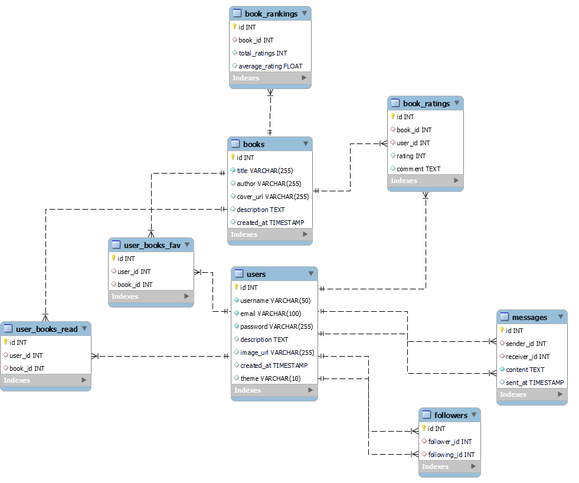

El Diagrama Entidad-Relación (ER) muestra la estructura de la base de datos utilizada en el proyecto **Red Social para Amantes de los Libros**. A continuación, se describen las tablas principales y sus relaciones.

---

### 👤 Tabla `users` - Usuarios
Contiene la información básica del usuario, como el nombre de usuario, correo electrónico, foto de perfil y preferencia de tema (claro u oscuro).
- **Campos**:
  - `id`: `INT AUTO_INCREMENT PRIMARY KEY` - Identificador único del usuario.
  - `username`: `VARCHAR(50) NOT NULL UNIQUE` - Nombre de usuario único.
  - `email`: `VARCHAR(100) NOT NULL UNIQUE` - Correo electrónico único.
  - `password`: `VARCHAR(255) NOT NULL` - Contraseña cifrada.
  - `description`: `TEXT` - Descripción del usuario.
  - `image_url`: `VARCHAR(255)` - URL de la foto de perfil del usuario.
  - `created_at`: `TIMESTAMP DEFAULT CURRENT_TIMESTAMP` - Fecha de creación del registro.
  - `theme`: `VARCHAR(10) DEFAULT 'light'` - Preferencia del tema (claro o oscuro).

---

### 📖 Tabla `books` - Libros
Contiene la información sobre los libros disponibles en la plataforma.
- **Campos**:
  - `id`: `INT AUTO_INCREMENT PRIMARY KEY` - Identificador único del libro.
  - `title`: `VARCHAR(255) NOT NULL` - Título del libro.
  - `author`: `VARCHAR(255)` - Autor del libro.
  - `cover_url`: `VARCHAR(255)` - URL de la portada del libro.
  - `description`: `TEXT` - Descripción del libro.
  - `created_at`: `TIMESTAMP DEFAULT CURRENT_TIMESTAMP` - Fecha de creación del registro.

---

### ⭐ Tabla `book_ratings` - Valoraciones de Libros
Registra las valoraciones y comentarios de los usuarios sobre los libros.
- **Campos**:
  - `id`: `INT AUTO_INCREMENT PRIMARY KEY` - Identificador único de la valoración.
  - `book_id`: `INT` - ID del libro al que pertenece la valoración (referencia a `books`).
  - `user_id`: `INT` - ID del usuario que realizó la valoración (referencia a `users`).
  - `rating`: `INT` - Calificación del libro (de 1 a 5 estrellas).
  - `comment`: `TEXT` - Comentario del usuario sobre el libro.

---

### 🏅 Tabla `book_rankings` - Ranking de Libros
Contiene el ranking calculado de cada libro basado en las valoraciones recibidas.
- **Campos**:
  - `id`: `INT AUTO_INCREMENT PRIMARY KEY` - Identificador único del ranking.
  - `book_id`: `INT` - ID del libro (referencia a `books`).
  - `total_ratings`: `INT DEFAULT 0` - Número total de valoraciones.
  - `average_rating`: `FLOAT DEFAULT 0` - Promedio de las valoraciones.

---

### 📚 Tabla `user_books_read` - Libros Leídos
Registra los libros que los usuarios han leído.
- **Campos**:
  - `id`: `INT AUTO_INCREMENT PRIMARY KEY` - Identificador único del registro.
  - `user_id`: `INT` - ID del usuario que ha leído el libro (referencia a `users`).
  - `book_id`: `INT` - ID del libro leído (referencia a `books`).

---

### 💖 Tabla `user_books_fav` - Libros Favoritos
Registra los libros que los usuarios han marcado como favoritos.
- **Campos**:
  - `id`: `INT AUTO_INCREMENT PRIMARY KEY` - Identificador único del registro.
  - `user_id`: `INT` - ID del usuario que marcó el libro como favorito (referencia a `users`).
  - `book_id`: `INT` - ID del libro favorito (referencia a `books`).

---

### 👥 Tabla `followers` - Seguidores
Gestiona las relaciones de seguimiento entre usuarios.
- **Campos**:
  - `id`: `INT AUTO_INCREMENT PRIMARY KEY` - Identificador único del registro.
  - `follower_id`: `INT` - ID del usuario que sigue (referencia a `users`).
  - `following_id`: `INT` - ID del usuario seguido (referencia a `users`).

---

### 💬 Tabla `messages` - Mensajes Privados
Registra los mensajes privados enviados entre usuarios.
- **Campos**:
  - `id`: `INT AUTO_INCREMENT PRIMARY KEY` - Identificador único del mensaje.
  - `sender_id`: `INT` - ID del usuario que envía el mensaje (referencia a `users`).
  - `receiver_id`: `INT` - ID del usuario receptor del mensaje (referencia a `users`).
  - `content`: `TEXT NOT NULL` - Contenido del mensaje.
  - `sent_at`: `TIMESTAMP DEFAULT CURRENT_TIMESTAMP` - Fecha y hora en que se envió el mensaje.

---

### 🖼️ Diagrama Visual

Este modelo de datos proporciona la estructura básica para gestionar usuarios, libros, valoraciones, comentarios, interacciones entre usuarios, y más en la plataforma **Red Social para Amantes de los Libros**.

Si deseas ver el diagrama visual de la base de datos, consulta la imagen a continuación:

---

## 🛠️ Herramientas Utilizadas
Este diagrama fue diseñado en **Mysql**.

---

Esta estructura de base de datos ha sido diseñada para soportar las funcionalidades y características del sistema, garantizando un rendimiento eficiente y la integridad de los datos.